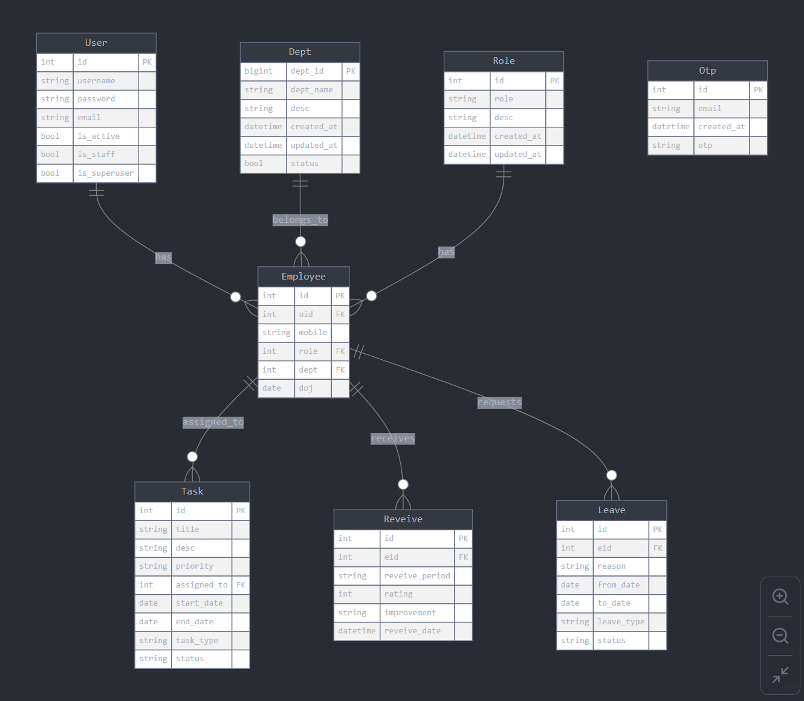

# EmployeePulse - HR Management System

## 📌 Introduction
EmployeePulse is a **comprehensive Human Resource Management System (HRMS)** designed to streamline HR operations, including:
- Employee recruitment
- Task management
- Performance/Review evaluations
- Leave management

The system provides a **user-friendly interface** with a **robust backend** to enhance HR functionalities within an organization.

---

## 🚀 Features Overview

### **🔹 Employee Management**
- Manage employee details, roles, departments, and reporting hierarchy.
- Assign and update roles (Admin, Manager, Team Leader, Employee).
- Associate employees with departments.
- Maintain reporting hierarchy.

### **🔹 Task Management**
- Assign, track, and manage employee tasks efficiently.
- Filter tasks by employee, status, or priority.
- Monitor task progress and completion.

### **🔹 Performance Management and Review Management**
- Conduct periodic performance evaluations and reviews.
- Assign ratings and feedback.
- Generate performance reports.

### **🔹 Leave Management**
- Automate leave tracking, requests, and approvals.
- Manage leave quotas.
- Admins/Managers can approve or reject leave requests.

### **🔹 User Authentication & Security**
- Secure login with username and password.
- Role-based access control.
- Password reset functionality.

---

## 🏗️ Technology Stack

### **Frontend:**
- HTML, CSS, JavaScript
- Bootstrap (for UI design)

### **Backend:**
- Django (Python)

### **Database:**
- PostgresSQL 

### **Deployment:**
- Hosted on a cloud platform i.e render.com

---

## 📌 Databse Schema

---

## 🌐 Deployment
- The application is deployed on **render.com** which cloud-based platform with automatic updates.
- A **GitHub repository** is maintained with proper version control.
- The application runs **24/7** on a live server.
- Link : https://employeepulse.onrender.com/

---

## 🏆 Conclusion
EmployeePulse is a **full-fledged HRM solution** designed to enhance organizational efficiency by automating HR processes. With its **modular design** and **scalability**, it provides a **robust** and **user-friendly experience** for managing employees, tasks, and performance seamlessly.

For further details, check the **GitHub repository** and **deployment link**.

📌 **GitHub Repository:** [Click Here](https://github.com/Suhas2002G/EmployeePulse)  
📌 **Live Demo:** [EmployeePulse on Render](https://employeepulse.onrender.com/)
